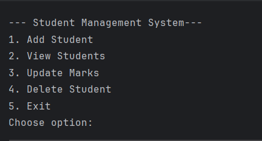
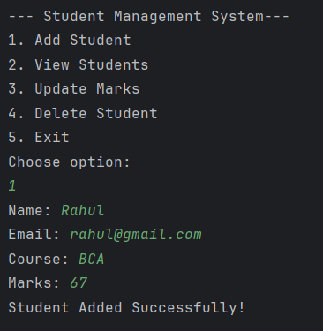
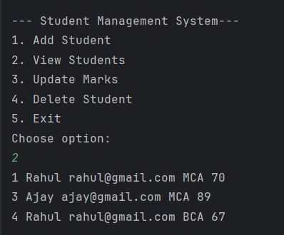
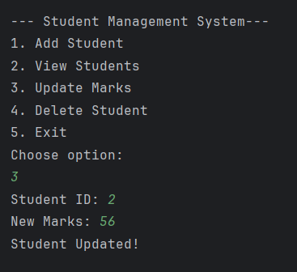
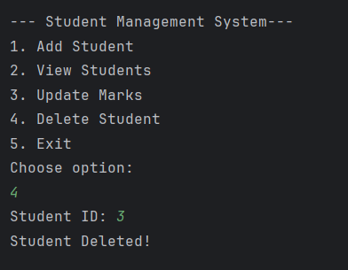

# Student Management System - JDBC

## Description
- A console-based Student management System built using JAVA, JDBC, and MySQL that performs full CRUD operations.
- This project demonstrates backend fundamentals, database connectivity, and clean project architecture using the DAO design pattern.

## Features
- Add new student records
- View all students
- Update student marks
- Delete student marks
- Interactive console menu
- Secure SQL queries using **PreparedStatement**
- Structured using **DAO Pattern**

## Technologies
- **Language**: Java
- **Connectivity**: JDBC
- **Database**: MySQL
- **IDE**: IntelliJ IDEA
- **Version Control**: Git and GitHub

## Database Setup
Run the following SQL commands in MySql workbench:
- CREATE DATABASE student_db;
- USE student_db;
- CREATE TABLE students( id INT PRIMARY KEY AUTO_INCREMENT, name VARCHAR(100), email VARCHAR(100), course VARCHAR(100), marks INT );

## How to Run 
1. Clone the repository
2. Open project in intelliJ Idea
3. Add Mysql Connector/j *.jar* file to project libraries
4. Update DB username and password in *DBConnection.java*
5. Run *Main.java*
6. Use console menu to interact with the system

## Screenshots
### Main Menu

### Add Student

### View Students

### Update Marks

### Delete Student

## Author
Arun Rangad